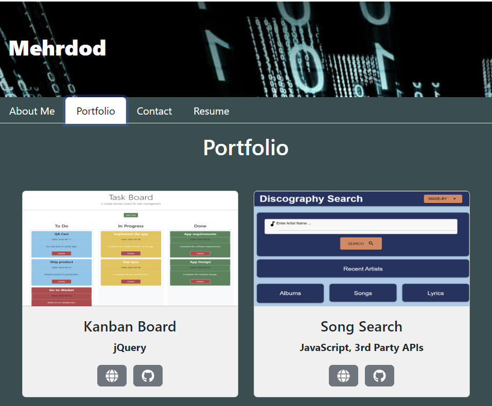
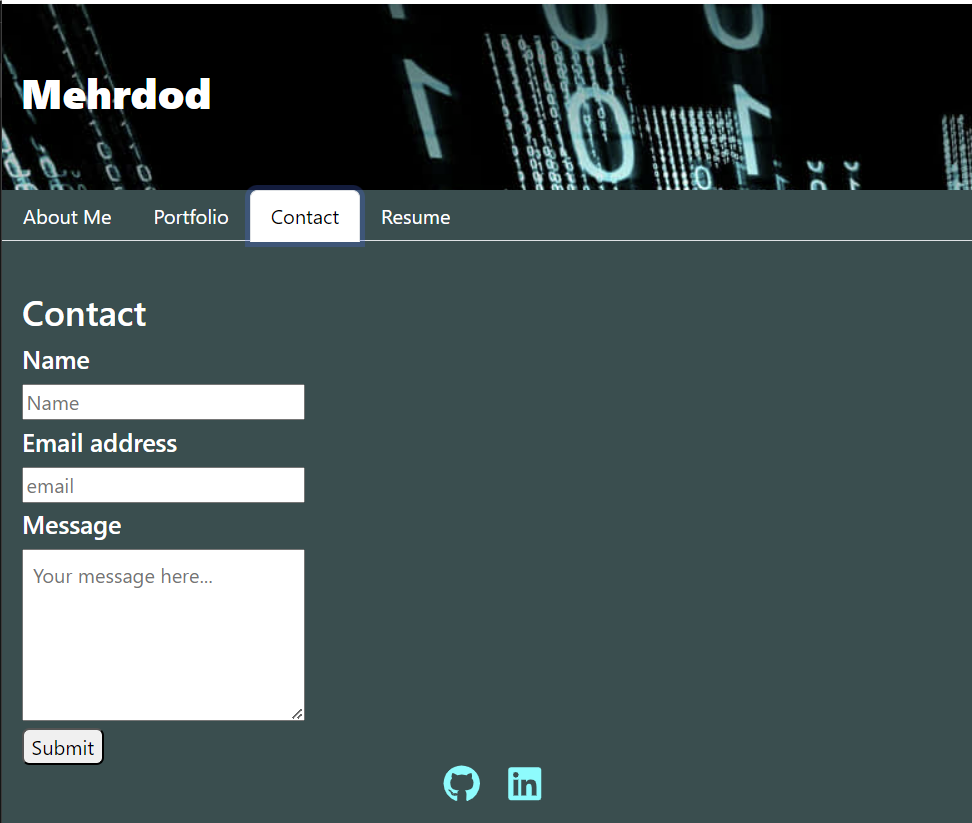
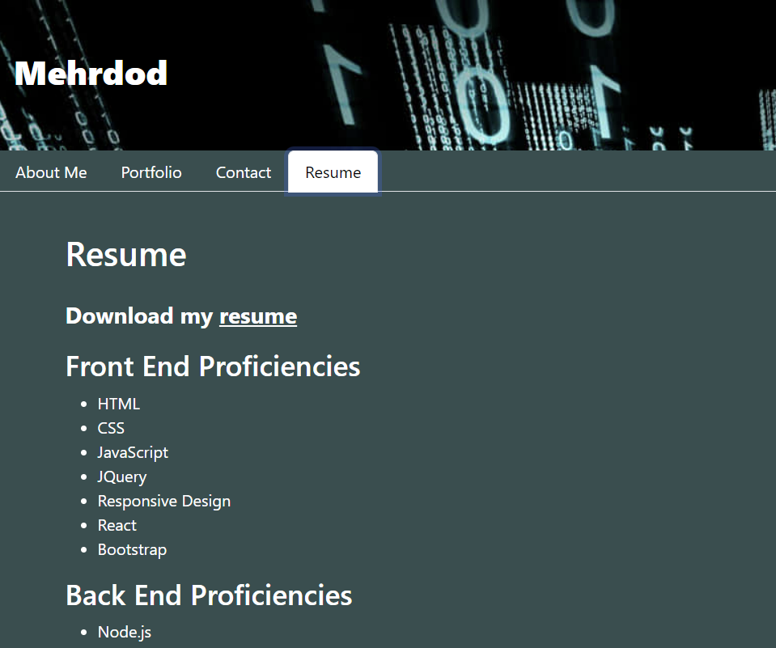

# React Portfolio

## Summary
In this challenge, we'll build a professional portofolio using React as the application's frontend.  The Portfolio showcases a collection of six applications that illustrate the developer's prowess in creating web applications using a variety of relevant and popular technologies in the web development field.

The specific features of this application, along with the user interactions, and employed technologies, are outlned in the following section.

## Features and Operation
The portfolio application features a common header that displays the developer's first name, a common footer to provides to developer's (GitHub public account) and (LinkedIn profile). The application also features a navigation system comprised of four tabs corresponding to separate and dedicated pages for (About me), (Portfolio), (Contact) and (Resume).

The following outlines the overall functionality and user interactions:

1. When the application loads, it automatically loads and lands in the (About me) page.  This page features a thumbnail photo fo the developer and a brief profile of the developer.  As indicated previously, the common footer displays and provides a link to developer's (GitHub public account) and (LinkedIn profile) at the bottom of the page.  The footer, as in the header, is common to all pages of the application.

2. When the user clicks on the Portfolio tab, the application navigates to the corresponding page and displays six of the developer's applications.  Each displayed application features the following sections:
* A screenshot of the application
* The title of the application
* Technology used in creating the application
* Link to the deployed app (presented as a globe icon)
* Link to the application's GitHub repo

3. When the user clicks on the Contact tab, the application navigates to the corresponding page and displays a form that can be filled out to contact the developer.  Given that the application currently doesn’t include a backend or use a third party API, the contact form doesn't save the entered information, and does not send out the completed form via the provided email.

The following outlines the Contact form structure:
* Name:  This field is used to enter the user's name
* Email address:  This field is used to enter the user's email address
* Message:  This field is used to enter the user's message

The following outlines the Contact form functionality and its exception handling:
* If the user places the cursor in the Name field and then moves it away from the input box without typing any characters, the following error error message is displayed at the bottom of the form: "Name is required"

* If the user places the cursor in the Email address field and then moves it away from the input box without typing any characters, the following error error message is displayed at the bottom of the form: "Email is required"

* If the user places the cursor in the Message field and then moves it away from the input box without typing any characters, the following error error message is displayed at the bottom of the form: "Message is required"

* If the user populates the required fields, but the email address is malformed (missing the @ sign), and clicks the (Submit) button, the following error message is displayed under the email input box:  "Please include @ in the email address"

* If the user intentionally leaves out all fields blanc and clicks the (Submit) button the following error messages are displayed, one by one, and until all required fields are filled in: "Username cannot be blank", "Email address cannot be blank" and "Message cannot be blank", respectively.

* Once the form is appropriately filled in and the user clicks the (Submit) button, all input fields in the form are cleared.

4. When the user clicks on the Resume tab, the application navigates to the corresponding page and displays an abridged version of the resume highlighting the frontend and backend proficiencies of the developer. If the user clicks on the "resume" link in front of "Download my" statement, the resume is downloaded and displayed on a new tab in the browser.

## Deployment
The application is deployed to the cloud based Netlify platform featuring continuous development and deployment of the hosted applications.  

## Executing the Live Application
To run the application on the Netlify platform, click the following link: https://mehrdod-react-portfolio.netlify.app/

## Executing the Application Locally
To run the application locally, perform the following
* Clone the project from: https://github.com/reztndev/React-Portfolio
* Open the project in Visual Studio Code
* Open a terminal and run the following:  npm run dev

## Screenshots of the Application:

